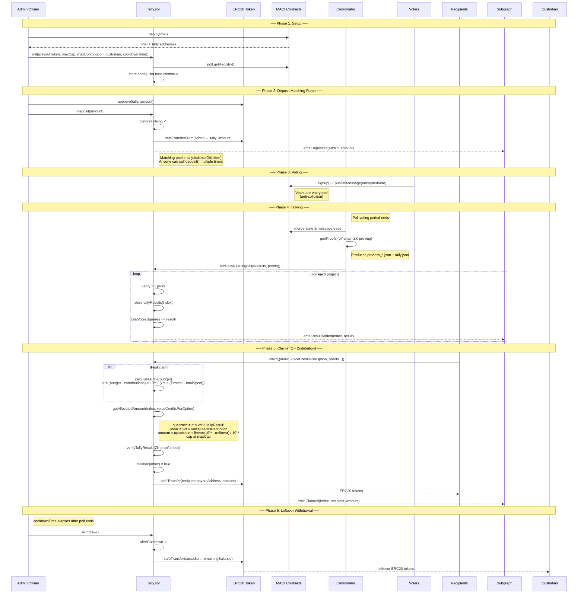

# MACI Platform

> [!IMPORTANT]  
> MACI Platform is no longer maintained. It can be used as is for running on chain voting rounds using [MACI v2](https://maci.pse.dev/docs/v2.x/introduction), thus we encourage you to fork it and use it as you see fit.
> MACI (the protocol), is still actively maintained and can be found [here](https://github.com/privacy-scaling-explorations/maci).

MACI Platform is a complete solution for running voting and funding rounds using [MACI](https://maci.pse.dev).

It is comprised of three components:

- Interface - a web app for managing and voting on MACI polls.
- Contracts - allows the deployment of the MACI contracts.
- Subgraph - queries blockchain to populate the Interface.

### MACI-Platform docs

- [Setup & Deployment](./docs/01_setup.md)
- [Adding Projects & Approving](./docs/02_adding_projects.md)
- [Creating Badgeholders/Voters](./docs/03_creating_badgeholders.md)
- [Voting](./docs/04_voting.md)
- [Results](./docs/05_results.md)
- [Troubleshooting of MACI](./docs/06_maci_troubleshooting.md)

### MACI docs

- [Documentation](https://maci.pse.dev/docs/introduction)

### Matching Pool & Quadratic Funding Flow



## Development

To run locally follow these instructions:

```sh
git clone https://github.com/privacy-scaling-explorations/maci-platform

pnpm install

cp packages/interface/.env.example packages/interface/.env # and update .env variables

pnpm build

```

At the very minimum you need to configure the subgraph url, admin address, maci address and the voting periods. For more details head to [Setup & Deployment](./docs/01_setup.md). Once you have set everything run:

```sh
pnpm run dev:interface

open localhost:3000
```

## Credits

The interface started as a fork of [easy-rpgf](https://github.com/gitcoinco/easy-retro-pgf), but now has gone a completely different direction and thus we decided to detach the fork to clarify the new direction of the project, which is not focusing anymore on RPGF only, but other types of voting and funding.

We are very thankful to the developers and all contributors of the [easy-rpgf](https://github.com/gitcoinco/easy-retro-pgf) project, and we hope to continue collaborating and wish to see their project succeed and help more communities/projects get funded.
